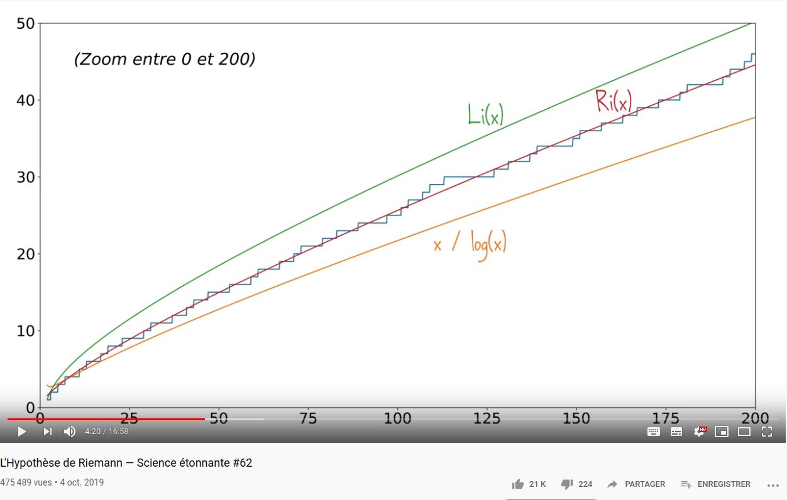

---
export_on_save:
  html: true
print_background: true
---

# Compter le nombre de nombres premiers {ignore = true}

Auteur : Franck CHAMBON

Il y a une infinité de nombres premiers comme le montre le théorème d'Euclide.
* $2$ est un nombre premier.
* On suppose que l'ensemble des nombres premiers est fini.
    + Notons $N$ le produit de ces nombres.
    + $N>1$ d'après le point précédent, et donc $N+1>2$.
    + Soit $p$ le plus petit facteur premier de $N+1$.
    + Par définition il divise $N$ mais ne divise pas $1$, donc ne peut pas diviser $N+1$.
* Contradiction, il y a une infinité de nombres premiers.

Cependant, il y a un nombre fini de nombres premiers jusqu'à $n$ quand $n$ est fixé. La répartition des nombres premiers, et sa connaissance fine est en lien direct avec le fameux problème de l'*[Hypothèse de Riemann](https://fr.wikipedia.org/wiki/Hypoth%C3%A8se_de_Riemann)*.
> * L'article Wikipédia (en anglais) [*Prime-counting function*](https://en.wikipedia.org/wiki/Prime-counting_function) fournit vite de nombreuses informations à ce sujet.
> * Une [vidéo](https://www.youtube.com/watch?v=KvculWl-jhE&vl=fr) de David Louapre (Science étonnante) en montre quelques aspects.

[](https://www.youtube.com/watch?v=KvculWl-jhE&vl=fr)

Montrons différents algorithmes pour calculer le nombre de nombres premiers jusqu'à $n$, pour $n$ fixé.

> Table des matières
[TOC]

---

## Méthode par force brute

### Avec un premier test de primalité

Utilisons la définition d'un nombre premier :
> Un nombre est premier si ses seuls diviseurs sont $1$ et lui-même.

```py {cmd="python3" run_on_save}
def est_premier(x):
    "retourne un booléen, True si x est premier, False sinon"
    if x < 2:
        return False
    for d in range(2, x):
        if x % d == 0:
            return False
    return True

def répartition_premiers(n):
    "Retourne le nombre de nombres premiers jusqu'à n"
    return sum(1 for x in range(2, n+1) if est_premier(x))

e = 4
n = 10**e
Qn = répartition_premiers(n)
print(f"Il y a {Qn} nombres premiers jusqu'à 10^{e}.")
```

Quelle est la complexité de cet algorithme ?

* La fonction `est_premier(x)` a un coût en $\mathcal O(x)$ ; dans le pire des cas ($x$ un nombre premier), la boucle fait presque $x$ tours à coûts constants.
* La fonction `répartition_premiers(n)` a donc un coût majoré par $\mathcal O \left(\sum\limits_{x=2}^{n-1} x\right)$, qui est en $\mathcal O\left(n^2\right)$.
* Mais en pratique, la boucle fait un tour complet uniquement pour les nombres premiers, dont on sait que la proportion parmi les nombres de $1$ à $n$ est environ $\dfrac1{\ln n}$. Ce qui conduit à la minoration du coût en $\mathcal O\left(\dfrac{n^2}{\ln n}\right)$.
* En conclusion, la complexité est presque quadratique, il est alors possible de l'utiliser raisonnablement jusqu'à $n \approx 10^4$.

### En améliorant le test de primalité

Utilisons une propriété d'arithmétique :
> Un nombre composé $x$ possède un diviseur strict inférieur à $\sqrt x$.

Ou plutôt sa contraposée :
> Si un nombre $x>1$ ne possède aucun diviseur strict inférieur à $\sqrt x$, alors $x$ est un nombre premier.

Il suffit d'ajouter deux lignes au code précédent :

```py {cmd="python3" run_on_save}
def est_premier(x):
    "retourne un booléen, True si x est premier, False sinon"
    if x < 2:
        return False
    for d in range(2, x):
        if d * d > x: # ie d > √(x)
            return True
        if x % d == 0:
            return False
    return True

def répartition_premiers(n):
    "Retourne le nombre de nombres premiers judqu'à n"
    return sum(1 for x in range(2, n+1) if est_premier(x))

e = 5
n = 10**e
Qn = répartition_premiers(n)
print(f"Il y a {Qn} nombres premiers jusqu'à 10^{e}.")
```

Quelle est la complexité de cet algorithme ?

* La fonction `est_premier(x)` a un coût en $\mathcal O(\sqrt x)$ ; dans le pire des cas ($x$ un nombre premier), la boucle fait presque $\sqrt x$ tours à coûts constants.
* La fonction `répartition_premiers(n)` a donc un coût majoré par $\mathcal O \left(\sum\limits_{x=2}^{n-1} \sqrt x\right)$, qui est en $\mathcal O\left(n^{3/2}\right)$.
* Mais en pratique, la boucle fait un tour complet uniquement pour les nombres premiers, dont on sait que la proportion parmi les nombres de $1$ à $n$ est environ $\dfrac1{\ln n}$. Ce qui conduit à la minoration du coût en $\mathcal O\left(\dfrac{n^{3/2}}{\ln n}\right)$.
* Concrètement, la complexité est un peu meilleure, il est alors possible de l'utiliser raisonnablement jusqu'à $n \approx 10^5$.

> Pour être plus efficace, il faut pouvoir donner la primalité des nombres par paquets, et non plus de manière individuelle.

## Utilisation du crible d'Ératosthène

Le crible d'Ératosthène permet d'**obtenir la liste de tous les nombres premiers** jusqu'à une certaine limite.

### Méthode
- $0$ et $1$ ne sont ni premiers, ni composés. *Remarque : le statut pour $1$ a varié au cours du temps.*
- Un entier supérieur à $1$ est soit premier, soit composé.
- Un entier composé $x$ s'écrit $d\times k$ avec $d, k$ entiers et $1 < d\leqslant k < x$.

Pendant le crible d'Ératosthène, on marque $0$, $1$ non premiers, puis tous les nombres composés jusqu'à une certaine limite, ne laissant non marqués que les nombres premiers.

#### Propriété 1
Si $x>1$ alors $x$ possède au moins un diviseur distinct de $1$,
et le plus petit d'entre eux est premier.
> **Preuve** : Soit $p$ le plus petit diviseur de $x$ distinct de $1$, s'il est composé, il s'écrit $k\times d$ avec $d, k$ entiers et $1 < d\leqslant k < x$, or $d$ est aussi un diviseur distinct de $x$ de $1$ qui contredit la minimalité de $p$. Ainsi $p$ est premier.

#### Propriété 2
Si $x > 1$ est composé, soit $p$ le plus petit diviseur de $x$ distinct de $1$,
- $p$ est premier (*propriété 1*)
- $p^2 \leqslant x$

On en déduit que tous les entiers composés inférieurs à $x$ possèdent un diviseur premier inférieur à $\sqrt x$.

> Cette propriété est très utile et trop souvent négligée !

#### Crible en animation, jusqu'à 120


*Source* : [Wikipédia](https://fr.wikipedia.org/wiki/Crible_d%27%C3%89ratosth%C3%A8ne)

Une fois les multiples de $2$ marqués, on marque les multiples de $3$, puis de $5$, puis de $7$. Il est inutile de marquer les multiples de $11$ en vertu de la propriété 2 ; $11^2 = 121 > 120$.

Quand on commence à marquer les multiples de $p$ premier, il suffit de commencer à $p^2$, en effet tous les nombres composés inférieurs à $p^2$  ont déjà été marqués ; ils possèdent un diviseur premier inférieur à $p$, toujours en vertu de la propriété 2.

#### Motivation
> Cette méthode, le crible d'Ératosthène, possède une bonne complexité, et sa simplicité lui permet de nombreuses variations et optimisations. En pratique cette méthode est plus rapide que d'autres cribles, plus délicats à implémenter, ayant pourtant une meilleure complexité théorique.
Cette méthode est aussi une base de réflexion pour construire d'autres cribles : **on peut parfois construire globalement un tableau de valeurs** d'une fonction sur un intervalle, plutôt que de calculer individuellement chaque valeur.

### Implémentation

#### Comprendre le code proposé ci-dessous
- On donne la *docstring*.
- On initialise une liste de booléens (crible), on fait comme si tous les entiers étaient premiers (True).
- On marque $0$ et $1$ comme non premiers (False).
- On fait une boucle pour $p$ partant de $2$, en incrémentant $p$ de $1$ à chaque tour :
    - si $p$ est premier, alors on va marquer tous les entiers $k$ multiples de $p$ à partir de $2p$ comme non premiers.
    - `range(p*p, n+1, p)` donne exactement les multiples de p allant de $p^2$ inclus, jusqu'à $n$ inclus.
- Quand $p^2 > n$, on est sûr d'avoir marqué tous les composés ; d'après la propriété 2.

#### Une proposition en Python
```py {cmd="python3" run_on_save}
def est_premier(x):
    "retourne un booléen, True si x est premier, False sinon"
    if x < 2:
        return False
    for d in range(2, x):
        if d * d > x: # ie d > √(x)
            return True
        if x % d == 0:
            return False
    return True

def Ératosthène(n):
    """
    Retourne le crible des nombres premiers inférieurs à n.
    crible[x] vaut True ou False, suivant que x est premier ou non.
    """
    if n < 0:
        return []
    crible = [True] * (n+1)
    crible[0] = False
    if n >= 1:
        crible[1] = False
    p = 2
    while p * p <= n:
        if crible[p]:
            for k in range(p * p, n+1, p):
                crible[k] = False
        p += 1
    return crible

# TEST
for n in range(1000):
    crible = Ératosthène(n)
    for x in range(1, n+1):
        assert crible[x] == est_premier(x), f"Échec du test pour borne = {n}, et x = {x}"
print("Test réussi")
print()

n = 100 # à modifier un peu si vous voulez
print(f"La liste des nombres premiers jusqu'à {n} :")
crible = Ératosthène(n)
print([p for p in range(n) if crible[p]])
print()

def répartition_premiers(n):
    "Retourne le nombre de nombres premiers jusqu'à n"
    crible = Ératosthène(n)
    return sum(1 for x in range(2, n+1) if crible[x])

e = 7
n = 10**e
Qn = répartition_premiers(n)
print(f"Il y a {Qn} nombres premiers jusqu'à 10^{e}.")
```

### Complexité

#### Complexité du crible d'Ératosthène
**Uniquement compréhensible en post-bac**

Le nombre d'opérations élémentaires pour faire ce crible pour les entiers inférieurs à $n$ est :
$$\sum_{p=2}^{\sqrt n} \frac {n-p^2} {p\ln p} \sim \int_{2}^{\sqrt n} \frac {n-x^2}{x\ln x} \mathrm{d}x \sim n\ln(\ln n)$$

Explication : avec la probabilité $\ln p$, $p$ est premier, et dans ce cas, on raye des nombres de $p^2$ à $n$, par pas de $p$. Ensuite on obtient un équivalent sous forme d'intégrale, et le [résultat attendu](https://en.wikipedia.org/wiki/Sieve_of_Eratosthenes#Algorithmic_complexity).

La complexité est :
* quasi-linéaire en temps : $\Theta\left(n \ln(\ln n)\right)$,
* et linéaire en espace.

#### Complexité pour le compte de nombres premiers
Faire le compte à la fin est plus rapide que le crible, ainsi on obtient une complexité finale en $\Theta\left(n \ln(\ln n)\right)$ avec cette méthode.

> En pratique, on a pu compter le nombre de nombre premiers jusqu'à $10^7$ avec ce code simple en Python et en quelques secondes. Il est possible de l'améliorer un peu :
> * En travaillant par tranches pour utiliser moins de mémoire, et donc rester dans la mémoire cache de l'ordinateur ; calculs bien plus rapides. On parle de crible par segments.
> * En utilisant une autre structure de données que la liste d'entiers Python. Il vaudra mieux utiliser les `bytearray`.
> * En ne considérant que $2$, puis les nombres impairs, on gagne un facteur $2$ en espace et en temps.
> * En mettant à part $2$ et $3$, les nombres premiers sont de la forme $6k±1$, où $k\in\mathbb N^*$. Ce qui peut faire gagner encore un peu de temps et d'espace.
> * On peut continuer un peu ainsi ; avec $2$, $3$ et $5$ à part, les nombres premiers sont congrus à $±1$, $±7$, $±11$, ou $±13$ modulo $30$. Ces considérations s'avèrent contre-productives en Python, où un code avec un style plus fonctionnel sera plus rapide qu'un code élaboré au style impératif. La raison étant que les parties fonctionnelles sont traitées avec des fonctions bien plus rapides.
>
> On peut alors, avec Python, sans trop de mal, aller jusqu'à $n = 10^9$ en moins d'une minute.
> Pour une description détaillée d'une implémentation très efficace en `C++`, on se référera à [cet article en anglais](https://github.com/kimwalisch/primesieve/wiki/Segmented-sieve-of-Eratosthenes).

Peut-on faire nettement mieux ?

## L'algorithme de Meissel-Lehmer

* [Ernst Meissel](https://fr.wikipedia.org/wiki/Ernst_Meissel) (1826-1895) était un astronome et mathématicien allemand.
* [Derrick Lehmer](https://fr.wikipedia.org/wiki/Derrick_Lehmer) (1905-1991) était un mathématicien américain.

Seul le compte total des nombres premiers nous intéresse, pas la liste des nombres premiers, ni même un tableau de booléens. En s'inspirant du crible d'Ératosthène, on va compter le nombre de nombres non rayés, sans en faire la liste !

La méthode initiée par Meissel, simplifiée par Lehmer en 1959, a été ensuite améliorée en 1985 par Lagarias, Millerand et Odlyzko. Un papier de [M.  Deleglise  et  J.  Rivat](https://www.ams.org/journals/mcom/1996-65-213/S0025-5718-96-00674-6/S0025-5718-96-00674-6.pdf) en fait l'écho. Le compte des nombres premiers jusqu'à $10^{18}$ a pu alors être effectué. En 2001, Xavier Gourdon a encore amélioré la méthode pour atteindre $10^{22}$. Actuellement les travaux de [Kim Walish](https://github.com/kimwalisch/primecount) ont permis d'atteindre un record à $10^{27}$.

### La méthode

Notons $Q(n, B)$ le nombre d'entiers dans $[\![2..n]\!]$ qui restent après avoir rayé tous les multiples $kp$ pour $p\leqslant B$, et $k>1$.

Exemples :
* $Q(100, 1) = 99$ ; seuls $0$ et $1$ sont rayés.
* $Q(100, 2) = 50$ ; il reste $2$ et $3, 5, 7, 9, 11, \cdots 99$.
* $Q(100, 10) = 25$; il ne reste que les nombres premiers inférieurs à $100$.

Comment calculer $Q(n, B)$ ?
* $Q(n, 1) = n-1$ ; aucun nombre n'a été rayé.
* Si $B$ est composé, alors $Q(n, B) = Q(n, B-1)$ ; on ne raye rien.
* Si $B^2 > n$, alors $Q(n, B) = Q(n, B-1)$ ; tous les composés inférieurs à $n$ ont déjà été rayés. Il ne reste que des nombres premiers.

Il reste donc uniquement à déterminer $Q(n, p)$, pour $p$ premier inférieur ou égal à $\sqrt n$. 

Quels sont les nombres rayés associés au nombre premier $p$ ?
> Il s'agit des nombres $p\times k$ où $k\in [\![2..n/p]\!]$ avec $k$ dont le seul diviseur inférieur à $p$ est $1$.

Exemple : 
* À l'étape $p=5$, on raye les nombres : $5\times 5,5\times 7,5\times 11, 5\times 13, 5\times 17,\cdots, 5\times 25,\cdots,5\times 35,5\times 37,\cdots$ 
* Il s'agit de rayer le produit de $5$ par : $5, 7, 11, 13, 17,\cdots, 25,\cdots, 35, 37,\cdots$

De manière générale :
* La liste précédente est l'ensemble des nombres non rayés avant l'étape $p$, que l'on limite à $n/p$, et sans compter les nombres premiers inférieurs à $p$.
* La quantité de nombre premiers inférieurs à $p$ est $Q(p-1, p-1)$.
* La quantité de nombres non rayés avant l'étape $p$, limité à $n/p$, est $Q(n/p, p-1)$.

On en déduit que pour $p$ premier inférieur ou égal à $\sqrt{n}$ :
$$Q(n, p) = Q(n, p-1) - (Q(n/p, p-1) - Q(p-1, p-1))$$

On rappelle que si $p$ n'est pas premier, on a : $Q(n, p) = Q(n, p-1)$ pour tout $n$.

Ceci nous pousse naturellement à utiliser de la programmation dynamique. On garde un ensemble de valeurs $Q(m, p-1)$ pour $m$ variés. On en déduira un ensemble de valeurs $Q(m, p)$ pour les mêmes $m$.

Les valeurs de $m$ nécessaires sont les nombres $k$ inférieurs ou égaux à $\sqrt n$ et les quotients entiers $n/k$ toujours pour $k$ inférieur ou égal à $\sqrt n$.

On stocke ces valeurs dans un dictionnaire.

### Implémentation

```py {cmd="python3" run_on_save}
def est_premier(x):
    "retourne un booléen, True si x est premier, False sinon"
    if x < 2:
        return False
    for d in range(2, x):
        if x % d == 0:
            return False
    return True

def répartition_premiers(n):
    "Retourne le nombre de nombres premiers inférieurs à n"
    if n < 2:
        return 0
    r = int(n**0.5) # partie entière de racine carrée de n
    m_lst = [n//k for k in range(1, r+1)]
    m_lst += [k for k in range(m_lst[-1]-1, 0, -1)]
    p = 1
    Q = {m: m-1 for m in m_lst}
    for p in range(2, r+1):
        if Q[p-1] < Q[p]: # p est premier
            qp = Q[p-1] # nombre de premiers inférieurs à p
            p2 = p*p
            for m in m_lst:
                if m < p2:
                    break
                Q[m] -= Q[m//p] - qp
    return Q[n]

#TEST
for n in range(100):
    assert répartition_premiers(n) == \
        sum(1 for x in range(2, n+1) if est_premier(x)), n
print("Tests réussis")

e = 10
n = 10**e
Qn = répartition_premiers(n)
print(f"Il y a {Qn} nombres premiers jusqu'à 10^{e}.")
```

Nous avons obtenu très rapidement la réponse pour $n=10^{10}$.

### Toujours un peu plus loin
La complexité de ce code est proche de $n^{0.75}$.

Cette méthode a été très nettement améliorée ; nous l'avons évoqué plus haut. Mais elle est aussi très intéressante, car elle peut être légèrement modifiée, non pas pour compter les nombres premiers, mais pour en faire la somme, ou la somme des carrés, jusqu'à une certaine limite. On peut imaginer même d'autres possibilités comme la somme sur les nombres premiers jusqu'à $n$.

Nous proposons deux problèmes raisonnables en difficulté où le lecteur pourra confronter ses idées d'implémentation :
1. [Calcul de la somme des nombres premiers jusqu'à $N$](https://www.spoj.com/problems/SUMPRIM1/).
2. [Calcul du dernier nombre premier quand la somme précédente est donnée](https://www.spoj.com/problems/SUMPRIM2/).

Il y a aussi des liens vers des exercices d'entraînement.